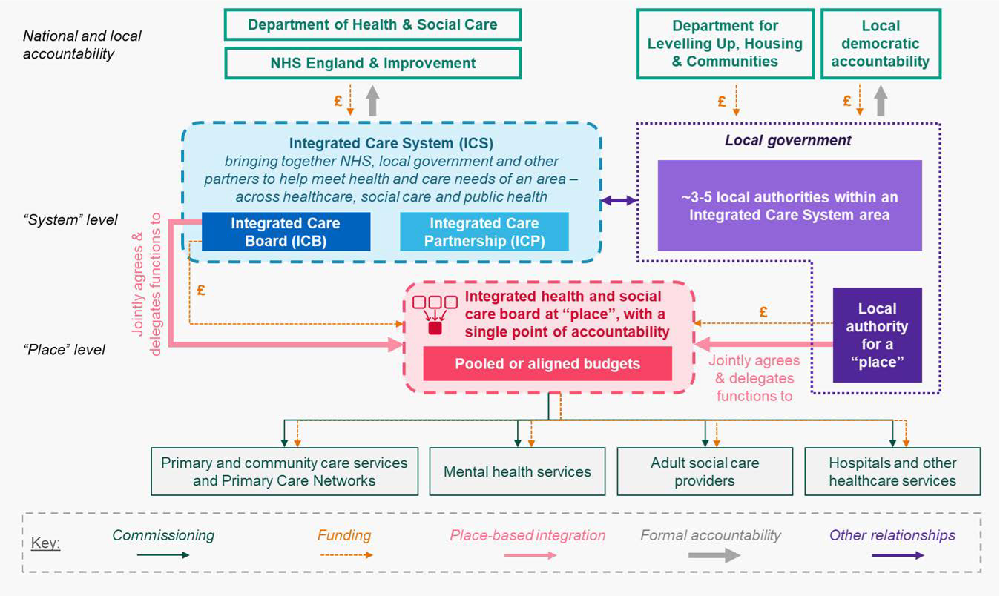

# NHS Structure

#### 1. Department of Health and Social Care (DHSC)
* Sets national health and care policy
* Allocates funding to NHSE and sets strategic direction through policies and mandates
* Creates legislation
* Led by the Secretary of State for Health and Social Care

#### 2. NHS England (NHSE)
* Oversees the operation of the NHS in England
* Directly accountable to the DHSC
* Allocates funding to the regional bodies
* Sets national standards and performance metrics
* Commissions specialist services (e.g cancer, trauma)
* Operates digital infra (e.g NHS App)
* In 2023, absorbed NHS Digital and Health Education England

#### 3. Integrated Care Systems (ICS)
* Regional-level structures that plan and coordinate care across areas
* 42 ICSs in England
* They bring together health and social care providers, local govt, and others to improve population health and reduce inequalities
* Each ICS consists of:
    * An Integrated Care Board (ICB): Statutory board for funding decisions
    * An Integrated Care Partnership (ICP): A broader, non-statutory alliance of local stakeholders

#### 4. Integrated Care Boards (ICB)
* Core decision-making bodies within ICSs.
* They plan and pay for most NHS services in their areas.
* Responsibilities:
    * Commission services from NHS Trusts, GPs, community providers
    * Set budgets and priorities
    * Work with public health and social care bodies
* ICBs replaced Clinical Commissioning Groups (CCGs) in July 2022.

#### 5. Places & Neighbourhoods (Sub-ICS units focused on local delivery)
* Place-based partnerships:
    * Cover towns, cities, or boroughs (typically 250k–500k people)
    * Focus on operational delivery and service integration across NHS, local government, and voluntary sector
    * Place-based arrangements are often non-statutory and collaborative, meaning Trusts retain their own boards and accountability to NHS England.
* Neighbourhoods (or neighbourhood teams):
    * Serve populations of 30k–50k
    * Neighbourhood Teams operationalize integrated care at the most local and personalized level, acting as the "delivery engine" of ICS ambitions.
    * Include professionals from GP practices, NHS Trusts (community/mental health), local authorities, and VCSEs. Deliver integrated, proactive care in local communities.
    * Promoted in the NHS Long Term Plan (2019) and reinforced in the Fuller Stocktake Review (2022), which called for the evolution of PCNs into more integrated, multidisciplinary Neighbourhood Teams.

#### 6. NHS Trusts and Foundation Trusts
* Service providers – hospitals, community health, mental health, and ambulance services.
    * NHS Trusts: Operate under tighter NHS England oversight.
    * NHS Foundation Trusts: More financial and operational autonomy, with local governing boards.
* Responsibilities:
    * Employ frontline clinical staff
    * Deliver patient care (e.g., surgery, emergency, outpatient, maternity)
    * Can operate at local or regional levels (e.g., a Trust may cover multiple hospitals)
