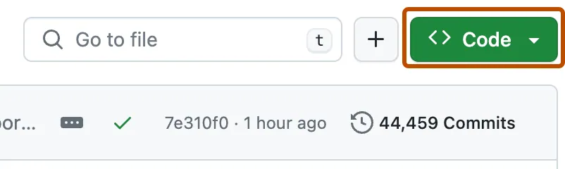
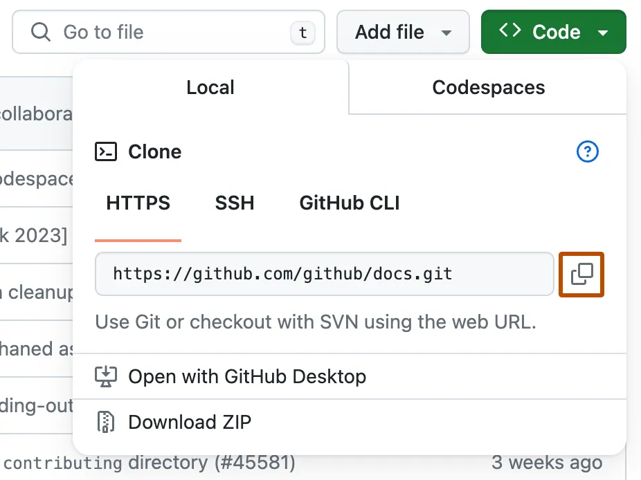
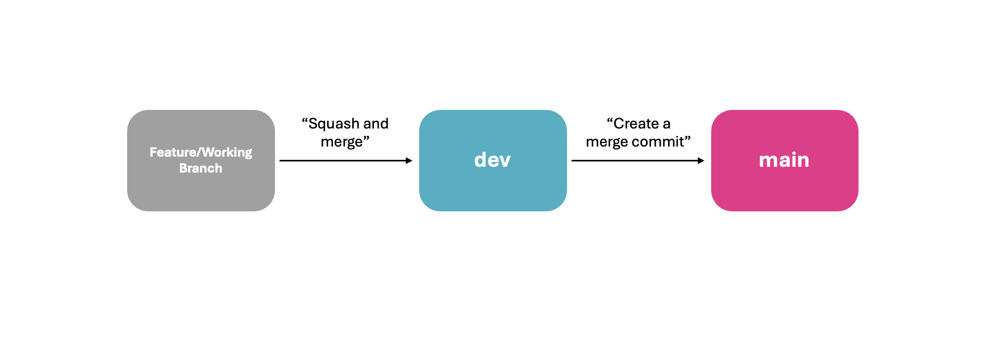

# Contributing to Projects on GitHub

To ensure seamless collaboration throughout the project development process, we strongly recommend the guidelines outlined below.

> NOTE: This document assumes you are setup with git. Follow [these instructions](./getting-setup.md) to do so as a pre-requisite.

## 1. Clone Repository to your Local

1. On GitHub, navigate to the repository of choice.
2. Above the list of files, click `<> Code`.



3. Clone the repository using HTTPS by clicking the copy icon under "HTTPS".



4. In your desired root directory, clone the repository using the copied URL:
```bash
git clone <URL>
```

## 2. Git Contribution Guide

This guide outlines the Git workflow for our data science team. We follow a structured branching strategy to maintain clean, organized, and production-ready code.

### Branching Structure

For every project repository, there will be two constant and protected branches: 
- `main` and
- `dev`

No commits are to be made directly to either of these branches. Branch protection rules should prevent you from doing so (see [Creating a New Repo](./creating-a-new-repo.md)).



#### `main`
* Purpose: Production-ready code.
* Deployment: Code in `main` is considered final and may be deployed or shared with external stakeholders.
* Merge Rule: Only merge from `dev` using "Create a merge commit".

#### `dev`
* Purpose: Integration and staging branch. All features and fixes are merged here first for testing and review.
* Role: Serves as the staging area for `main`. This is where final QA, integration testing, and stakeholder reviews happen.
* Merge Rule: Only merge from a working branch using "Squash and merge".

#### `working-branch`
* Purpose: Temporary branches for feature development, bug fixes, experiments, etc.
* Naming Convention: Use clear names like feature/model-x-v2, bugfix/data-leakage, or experiment/ab-test-v3.
* Merge Rule: Merge into dev using "Squash and merge" to keep commit history clean.

### Workflow Summary

1. Create a Working Branch

``` bash
git checkout dev
git pull
git checkout -b feature/your-branch-name
```

2. Work on Your Changes
* Commit locally and push to your remote working branch.
* Ensure code is well-documented and tested.

3. Open a Pull Request to `dev`
* Title your PR clearly.
* Include a summary of changes and context.
* Tests and code are review are conducted here.
* **Use "Squash and merge" when merging**.

4. Staging in `dev`
* Multiple working branches are merged into `dev`.

5. Promote to `main`
* Once `dev` is stable and ready, open a PR from `dev` to `main`.
* Use "Create a merge commit" to preserve commit history and make it easier to trace past releases.

### Best Practices

* Pull latest changes to `dev` before creating a new working branch.
* Keep PRs small and focused.
* Write clear, descriptive commit messages. Have fun with [gitmoji.dev](https://gitmoji.dev/)
* Review and test code thoroughly before merging.
* Never work directly on `dev` or `main`.
