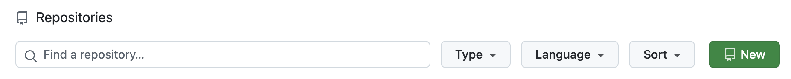
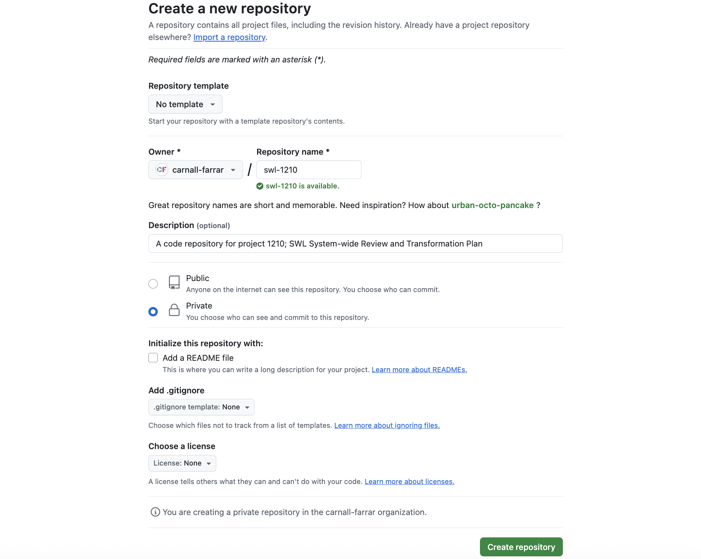
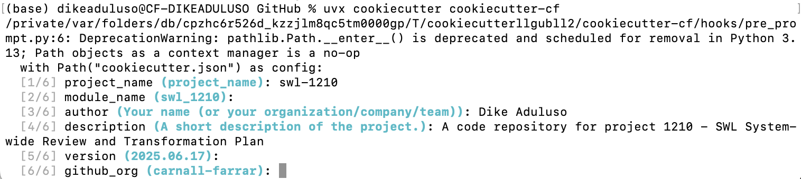

# Starting a New Project

## 1. Create a GitHub Repository

- Go to the [Carnall-Farrar github organisation](https://github.com/carnall-farrar).
- Under "Repositories" click `New`

- In the create a new repository page:
    - Repository template: **No template**
    - Owner: **carnall-farrar**
    - Repository name: `<repository-name>` 
    > HINT: use lowercase characters and `-` as a separator. Add the project code if applicable e.g. "swl-1210"
    - Description: Enter a brief description such as "A code repository for the \<project name\> project". You can change this later if you'd like.
    - **Make the repository private**
    - Keep "Add a README file" unchecked
    - .gitignore template: **None**
    - Choose a licence: **None**
    - Finish by clicking `Create repository`



## 2. Initialize a local repository with Cookiecutter-CF

- In your local terminal, navigate to the directory where you clone your github repos. We recommend you create a "GitHub" folder in your Documents directory `Documents/GitHub`:

```bash
cd Documents/GitHub/
```

- If you're all setup as per our [Getting Set-up guide](./getting-setup.md), you will have `uv` installed. Run the following to create a project repository with our internal template.

```bash
uvx cookiecutter https://github.com/carnall-farrar/cookiecutter-cf.git
```

- For the prompts:
   - `project_name`: Enter **the same** "-" separated `<repository-name>` you used to create the github repository above.
   - `module_name`: This is defaulted to the `project-name` modified to replace "-" with "_". Hit enter to accept the default (recommended).
   - `author`: Enter your name
   - `description`: Enter a short description of the project, similar to what was used to create the github repository above.
   - `version`: Your project needs a version number to keep track of releases. At CF we use [CalVer](https://calver.org/) so it's easier to track releases through time. The default is set to today's date. Do not modify.
   - `github_org`: The default is set to carnall-farrar's github organisation. Do not modify.



## 3. Connect the local repository with the newly created GitHub repository

- Replace "<project_name>" in the following commands and paste into your terminal:

```bash
cd <project_name>
git init
git remote add origin https://github.com/carnall-farrar/<project_name>.git
git branch -m main
git add .
git commit -m ":rocket: Repo launch with Cookiecutter-CF"
git push -u origin main
```

### 3b. Connect the local repository as a new branch on an existing GitHub repository

```bash
cd <project_name>
git init
git remote add origin https://github.com/carnall-farrar/<existing_repo>.git
git branch -m revamp
git add .
git commit -m ":rocket: Repo launch with Cookiecutter-CF"
git push -u origin revamp
```

## 4. Create a `dev` branch

## 5. Setup branch protection rules

## 6. Enable gh-pages